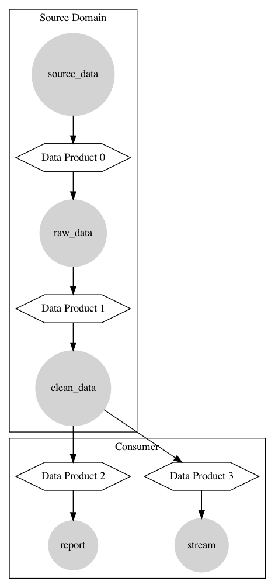

# Proof of concept - Data Mesh Diagram Generator

Proof of concept to generate a png from a yml file describing a Data Mesh.

WARNING: This is not production ready, you should expect failures, etc.

# Getting Started

To get started clone the repository

```shell
$ git clone https://github.com/dorzey/data-mesh-diagram-generator.git
$ cd data-mesh-diagram-generator
```

Then install the package

```
$ poetry install
```

If you don't have Poetry then do

```shell
$ pip install poetry
```

To generate a png of the Data Mesh specified in the yml run

```shell
$ poetry run data_mesh_diag <path to data mesh yml>
```

Which will give you something like


